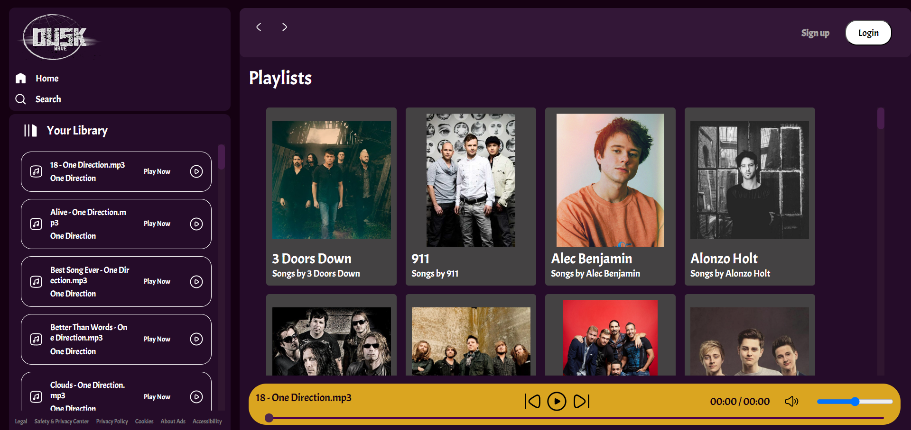

# Duskwave - Music Streaming Application



## Overview
This project is a simple web-based music player application built using HTML, CSS, and JavaScript. It allows users to play audio files and control playback options.

## Features
- **Audio Playback**: Users can play audio files in various formats (e.g., MP3, WAV).
- **Playlist Management**: Create, edit, and delete playlists to organize your music collection.
- **Playback Controls**: Control playback options such as play, pause, stop, skip, and volume control.
- **Responsive Design**: The application is designed to work seamlessly across different devices and screen sizes.

## Installation
1. Clone this repository to your local machine:
    ```
    git clone https://github.com/18Aswin/DuskWave---Music-Streaming-Application.git
    ```
2. Open the `index.html` file in your web browser to start using the music player application.

## Usage
- **Adding Music**: Place your audio files in the `songs` directory within the project folder.
- **Playback Controls**: Use the controls provided to play, pause, stop, skip tracks, and adjust volume.
- **Managing Playlists**: Edit or delete playlists by selecting them from the playlist menu and using the appropriate buttons.

## Technologies Used
- HTML
- CSS
- JavaScript

## Credits
This project was created by Aswin A Nair
